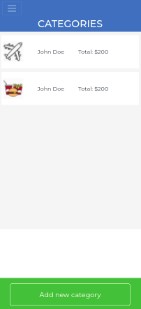

# Budget App

> Budget app is a mobile web application where you can manage your budget: you have a list of transactions associated with a category, so that you can see how much money you spent and on what. Built with Ruby on Rails, Saas, PostgreSQL and other technologies.

Additional description about the project and its features.



## Built With

- Major language
  - Ruby
  - Rails
  - RSpec
  - PostgreSQL
  - CSS & Sass
  - ERB

- Technologies used

```bash
- Git(version control)
```

## Getting Started

To get a local copy up and running follow these simple example steps.


### Prerequisites

- A text editor(preferably Visual Studio Code)

### Install

- [Git](https://git-scm.com/downloads)
- [Ruby](https://www.ruby-lang.org/en/downloads/)
- [PostgreSQL](https://www.postgresql.org/download/)
- [Node.js](https://nodejs.org/en/download/)
- `gem install rails`

### Usage

#### Clone this repository

```bash
git clone
$ https://github.com/netman5/budget-app.git
$ cd budget-app
```
```

#### Run project

```bash
- bundle install
- rails s
```

### Run Test

  ```bash
  - rspec spec/
  ```

## Author

👤 **Ola Ishola**

- GitHub: [@netman5](https://github.com/netman5)
- Twitter: [@Orlaish](https://twitter.com/Orlaish)
- LinkedIn: [LinkedIn](https://www.linkedin.com/in/ola-ishola/)

## 🤝 Contributing

Contributions, issues, and feature requests are welcome!

Feel free to check the [issues page](https://github.com/netman5/budget-app/issues).

## Show your support

Give a ⭐️ if you like this project!

## Acknowledgments

- Ruby on rails Community
- [Gregoire Vella on Behance](https://www.behance.net/gregoirevella)

## 📝 License

This project is [MIT](https://opensource.org/licenses/MIT) licensed.